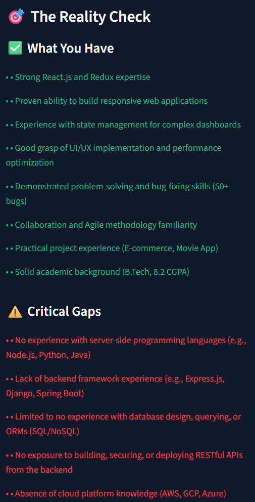
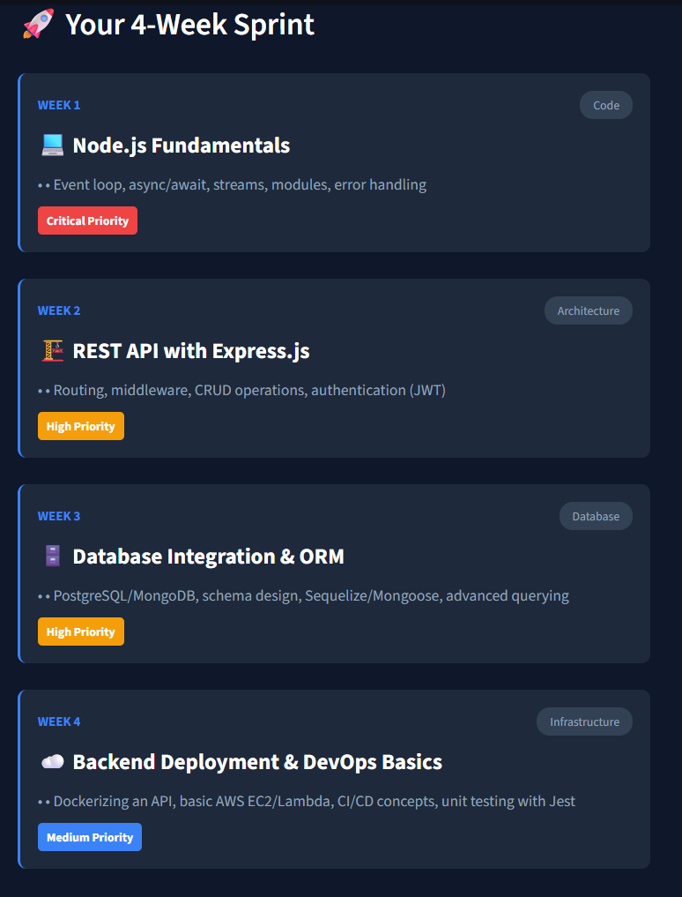

# 🚀 Skill Gap Diagnostic & 30-Day Learning Planner

> **Turning "Blind Career Preparation" into "Strategic, Data-Driven Upskilling."**


---

## 🧐 The Problem
Millions of students practice "blind preparation." They consume random tutorials (React, Node, etc.) without knowing if they meet the specific industry standards for their target role. They lack an objective technical audit.

## 💡 The Solution
An AI-powered technical interviewer that:
1. **Parses your Resume** (PDF) and extracts skills.
2. **Compares it mathematically** against a "Gold Standard" Blueprint using Python Set Theory.
3. **Generates a bespoke 30-Day Learning Roadmap** using Google Gemini to fill *only* your missing gaps.

---

## 📸 Screenshots

### 1. The Dashboard
*Simple drag-and-drop interface for resumes.*


### 2. The Scorecard (The Math)
*We calculate a deterministic Match Score using set intersection.*


### 3. The Personalized Roadmap
*A generated weekly sprint for your specific missing skills.*


---

## ⚙️ How It Works (The Architecture)

1.  **Input:** User uploads PDF -> `pdfplumber` extracts text.
2.  **ETL:** Google Gemini 1.5 Flash parses raw text into structured JSON.
3.  **Logic Core:** Python calculates `Blueprint Set - User Set = Gaps`.
4.  **Output:** Generative AI creates a curriculum based *only* on the `Gaps`.

---

## 🛠️ Tech Stack

* **Frontend:** Streamlit (Python)
* **LLM:** Google Gemini 1.5 Flash (via API)
* **Data Processing:** pdfplumber, pandas
* **Logic:** Python Native Set Operations

---

## 🚀 How to Run Locally

1. **Clone the repo**
   ```bash
   git clone [https://github.com/YOUR_USERNAME/skill-gap-analyser.git](https://github.com/YOUR_USERNAME/skill-gap-analyser.git)
   cd skill-gap-analyser
